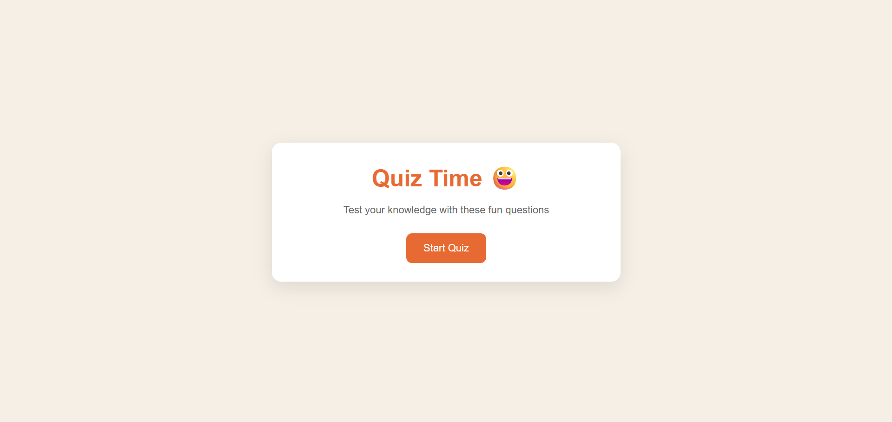
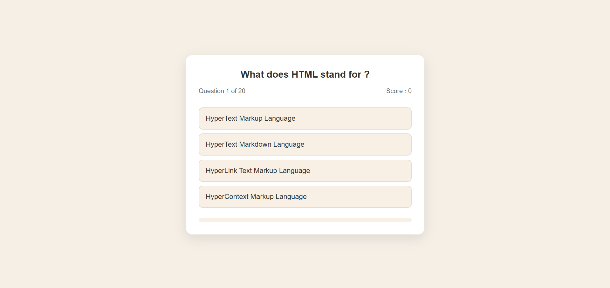
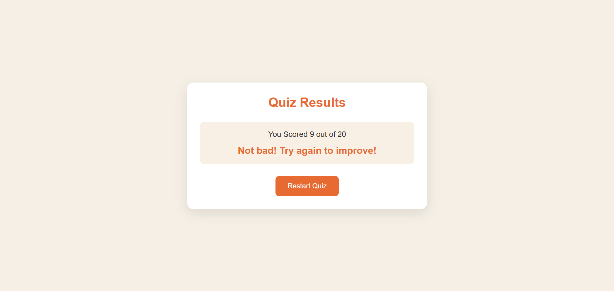

## 🎉 Quiz App  

An interactive **Quiz Application** built with **HTML, CSS, and JavaScript**.  
It lets users test their knowledge with fun multiple-choice questions and provides instant results with feedback.  

## 🌐 <a href="https://quiz-app-diwaker.netlify.app/" >Live Link </a>

## ✨ Features
- 🚀 Start screen with quiz instructions  
- ❓ Multiple-choice questions with 4 options  
- 📊 Real-time score tracking  
- ✅ Final result screen with feedback message  
- 🔄 Restart quiz option  
- 🎨 Responsive and clean UI  


## 🛠️ Tech Stack
- **HTML5** – Structure  
- **CSS3** – Styling  
- **JavaScript (ES6)** – Quiz logic & interactivity  


## 📸 Screenshots

### ▶️ Start Screen  


### ❓ Question Screen  


### 🏆 Result Screen  



## 🚀 Getting Started  

### 1. Clone the repository  
```bash
git clone https://github.com/your-username/quiz-app.git

